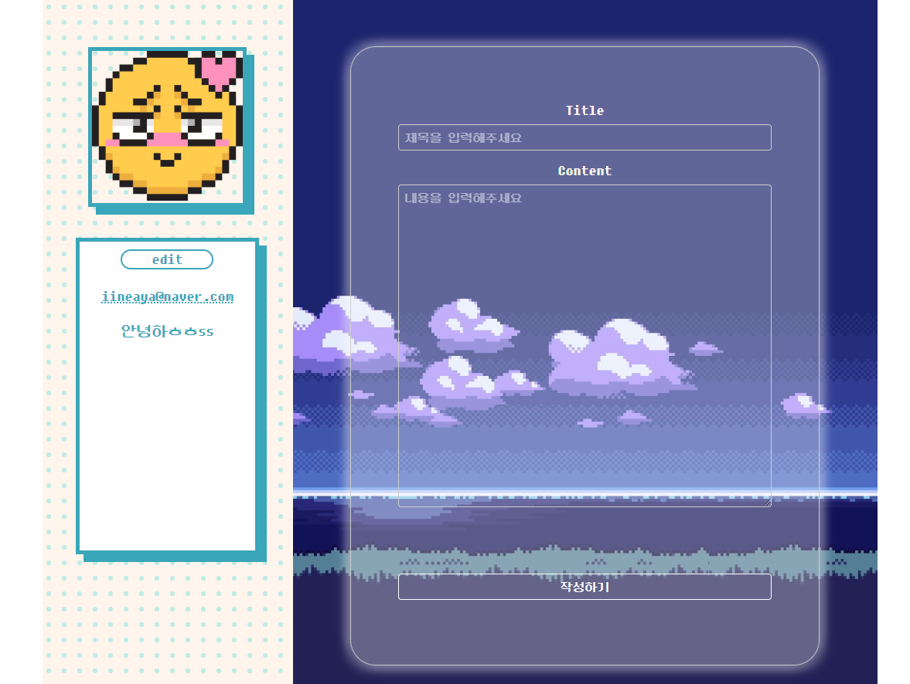

# FlowLog

- 블로그 기능의 Next.js 기반의 웹입니다.
- 포스트 탭에서 포스트를 작성할 수 있습니다.
- 방명록 탭에서 친구의 블로그에 방명록을 작성할 수 있습니다.

### A. 개발 팀원

- [권오현](https://github.com/fbre0717)
- [박이내](https://github.com/YinaePark)

---

### B. 개발 환경

- OS: Windows 11(22H2)
- FrameWork: Next.js
- Database: mongoDB, AWS s3
- Language: Typescript
- IDE: VSCode

---

### C. Magor features

#### 메인 페이지

|  |  |  |
| --------------------------------------------- | ---------------------------------------------- | ---------------------------------------------- |

- 카카오 로그인에 성공하면 메인 페이지로 이동합니다.
  - 최근 포스트 목록을 확인할 수 있습니다.
  - 최근 포스트 목록에서 포스트를 클릭하면 해당 포스트를 작성한 사람의 블로그로 이동합니다.

* 헤더에 있는 버튼을 통해 다른 링크로 이동할 수 있습니다.
  - 내 블로그 버튼을 클릭하면 내 블로그로 이동합니다.
  - 친구 목록 버튼을 클릭하면 내가 팔로우하고 있는 친구 목록이 표시됩니다.
  * 친구 목록에 표시된 주소를 눌러 친구의 블로그를 방문할 수 있습니다.
  - 로그아웃 버튼을 누르면 로그아웃되고, 로그인 창으로 이동합니다.

---

#### 내 블로그

|  |  |  |
| --------------------------------------------- | ---------------------------------------------- | ---------------------------------------------- |

- 헤더에는 내 캐릭터가 표시됩니다.
  - 헤더 아래의 edit 버튼을 통해 표시될 캐릭터를 수정할 수 있습니다.
- 내 프로필 탭에는 내 아이디(이메일 주소)와 프로필사진, 자기소개가 표시됩니다.
  - edit 버튼을 눌러 프로필사진과 자기소개를 수정할 수 있습니다.
- 내 블로그에는 포스트 탭과 방명록 탭이 존재합니다.

#### 포스트 탭

|  |  |  |
| ---------------------------------------------- | ---------------------------------------------- | ---------------------------------------------- |

- 내 블로그에는 내가 작성한 포스트가 표시됩니다.

* 친구의 블로그에 방문해서 포스트를 읽을 수 있습니다.

#### 방명록 탭

|  |  |
| ----------------------------------------------- | ----------------------------------------------- |

- 친구들이 내 블로그에 방문해서 작성한 글이 표시됩니다.
- 하단에는 글을 작성한 친구들의 닉네임이 표시됩니다.
- 친구의 블로그에서도 방명록 탭에 글을 작성할 수 있습니다.

### D. 기술 및 로직

#### SSG 렌더링

- Nextjs는 SSG와 SSR을 제공하는데, SSG를 사용하였다.
- blogId와 postId를 기준으로 동적라우팅을 하였고,
  SSG를 하기 위해 getStaticPaths와 getStaticProps를 정의해주었다.
- getStaticPaths를 이용하여 미리 렌더링할 path들을 반환하였고,
  getStaticProps를 이용하여 미리 렌더링할 내용을 반환하였다.
- 이 2가지 함수는 서버사이드에서 실행되기때문에, 직접적으로 DB에 접속하는 등, 서버에서 실행가능한 함수를

- blogId/posts에 접속하면, React의 useRouter을 이용하여 blogId가 작성한 post를 모두 가져와서 보여주었다.
- DB에는 blogId를 기준으로 새로운 포스트를 작성할때마다 새로운 postId를 부여하였다.
- DB에서 blogId, postId를 key로 document를 찾을 수 있었다.

#### 친구

- 친구 목록을 누르면 모달이 출력되서 내가 팔로우하는 친구들의 목록을 보여주고, 클릭하면 그 블로그로 이동할 수 있다.

- next-auth/react의 useSession을 이용하여 현재 로그인한 사용자의 정보를 확인하여, 본인에 블로그에 접속한 경우와 타인의 블로그에 접속한 경우에 따라 프로필화면에 차이가 있다.
- 타인의 블로그에 접속한 경우에는 follow여부에 따라 follow버튼 및 unfollowing버튼이 활성화되고, 클릭하면 DB의 친구정보가 갱신된다.

- Next의 Link 컴포넌트를 사용하면 새로고침할 필요없이 미리 생성된 페이지에 접속할 수 있다.

#### 사진

- AWS IAM 계정을 생성하고, S3 버킷에 이미지를 업로드하고, 이미지 주소를 얻어 프로필 사진을 보여주게 되었다.

#### MongoDB

- MongoDB Atlas를 이용하여 원격으로 DB를 저장하였고, mongoose를 이용하여 Next내에서 DB와 연결할 수 있었다.
